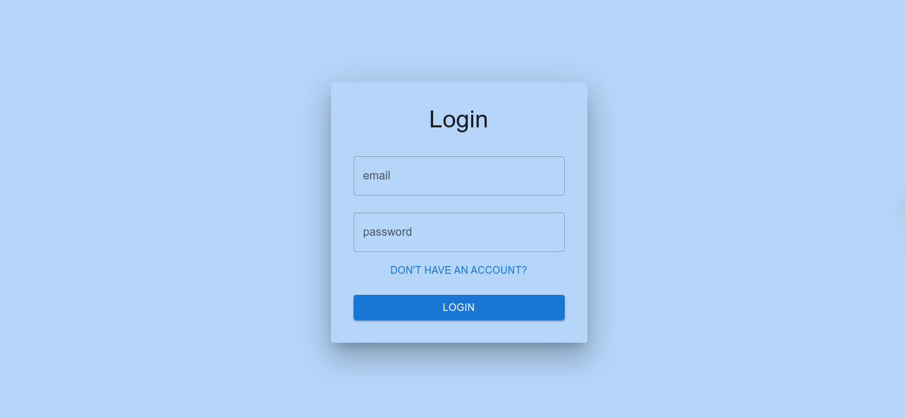
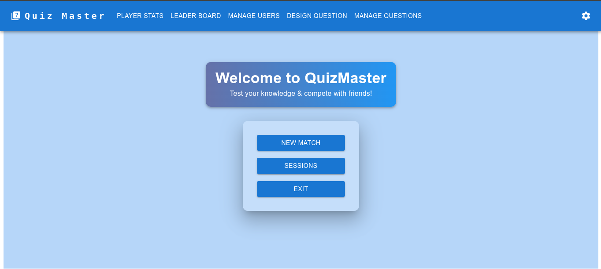
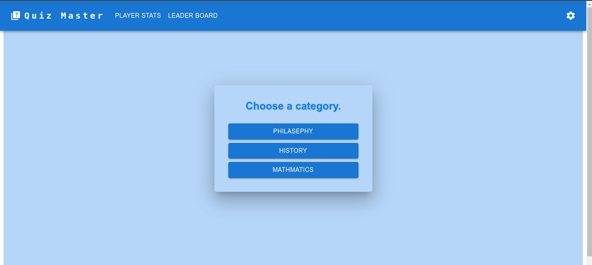
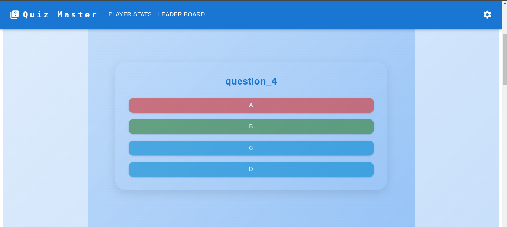
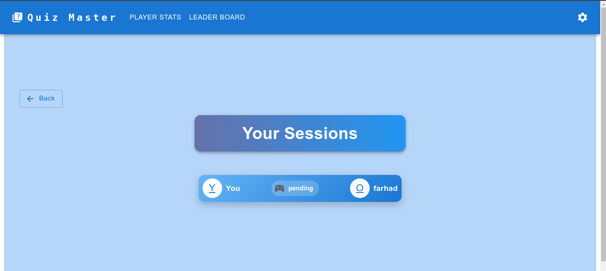
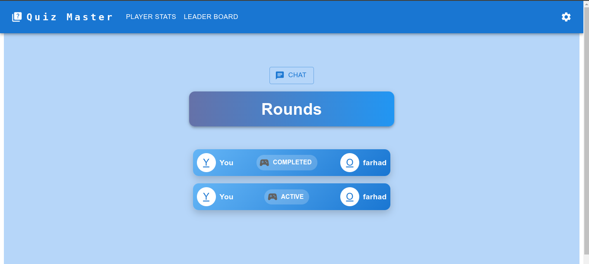
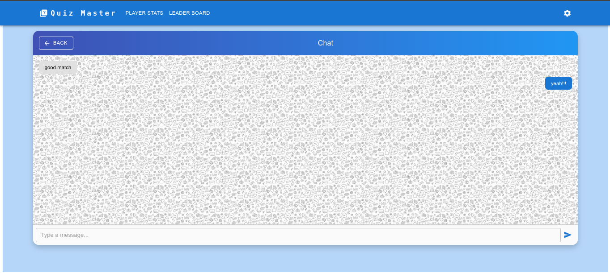
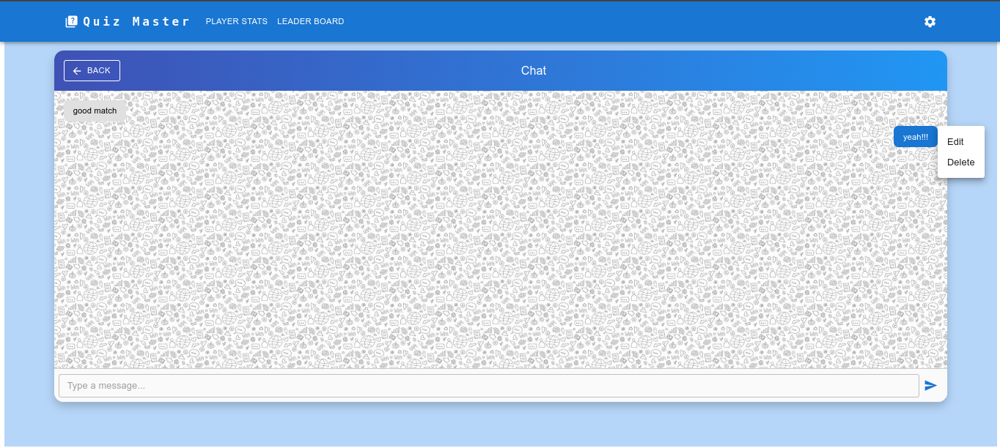
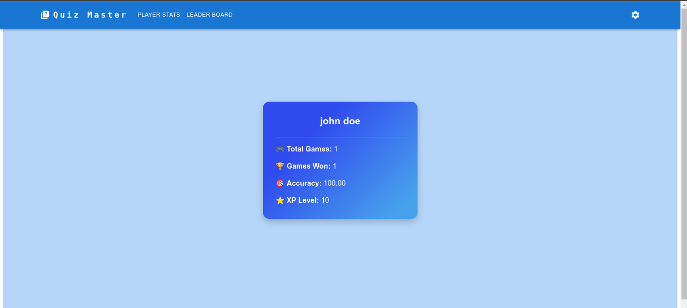

# Quiz Master - Multiplayer Quiz App

## Description

Quiz Master is a multiplayer quiz application designed for university Database Design course, featuring a backend with Node.js, Express, and PostgreSQL, and a React frontend with Material UI. The app includes user authentication via JWT, and live chat functionality using Socket.io. The project emphasizes database design while providing a full-stack development experience.

## Contents

- [Installation](#installation)
- [Features](#features)
- [Technologies Used](#technologies-used)
- [Screenshots](#screenshots)
- [License](#license)
- [Contribution](#contribution)

## Installation

1. Clone this repository to your local machine:

```bash
git clone https://github.com/kasrarezaee/QuizOfKings.git
```

2. Set up the backend:

```bash
cd backend
npm install
```

3. Configure the PostgreSQL database:

- Create a new database named `QuizOfKings`
- Update the connection settings in `backend/config/db.config.js`

4. Set up the frontend:

```bash
cd ../frontend
npm install
```

5. Run the application:

- Start the backend server:

```bash
cd ../backend
npm start
```

- Start the frontend development server:

```bash
cd ../frontend
npm run dev
```

## Features

1. **User Authentication**

   - Secure JWT-based authentication system
   - User registration and login functionality
   - Protected routes for authenticated users

2. **Gameplay**

   - Multiple question categories
   - Score tracking and leaderboards

3. **Social Features**

   - Live chat with opponents using Socket.io
   - Player matchmaking system
   - Game history tracking

4. **Admin Panel**
   - Question management
   - User management
   - Game statistics

## Technologies Used

- **Frontend**: React, Material UI, Socket.io Client
- **Backend**: Node.js, Express, JWT Authentication
- **Database**: PostgreSQL
- **Real-time Communication**: Socket.io
- **State Management**: React Context API
- **Build Tools**: Webpack, Babel

## Screenshots



















## License

This project is licensed under the MIT License. See the [LICENSE](LICENSE) file for details.

## Contribution

Contributions are welcome! Please follow these steps:

1. Fork the repository
2. Create a new branch for your feature (`git checkout -b feature/AmazingFeature`)
3. Commit your changes (`git commit -m 'Add some AmazingFeature'`)
4. Push to the branch (`git push origin feature/AmazingFeature`)
5. Open a Pull Request
